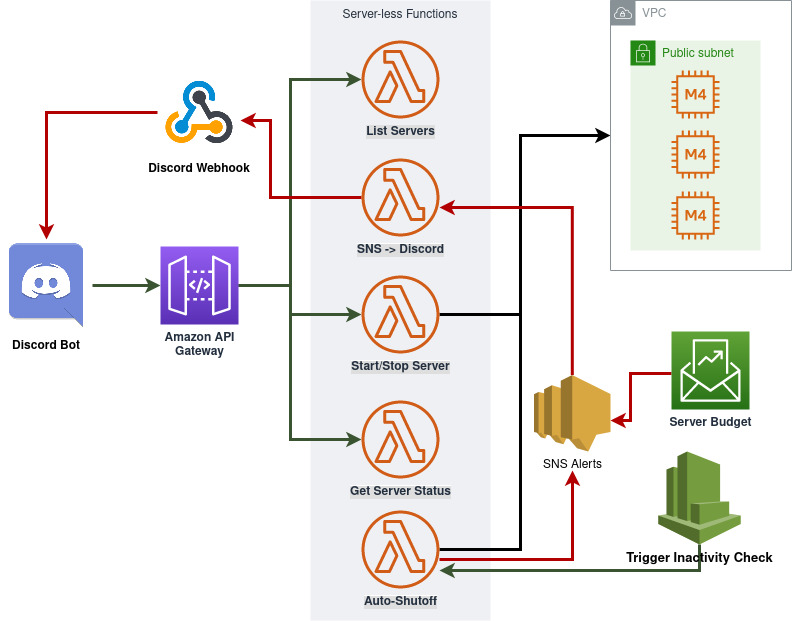

# mcdiscordbot

Allow starting and stopping of Minecraft server instances hosted in AWS via a
Discord bot interface. 

[]

## Features 
* APIGateway
* SNS
* Lambda
* EC2
* CloudWatch
* Cost Analyzer 
* Tag Policies

